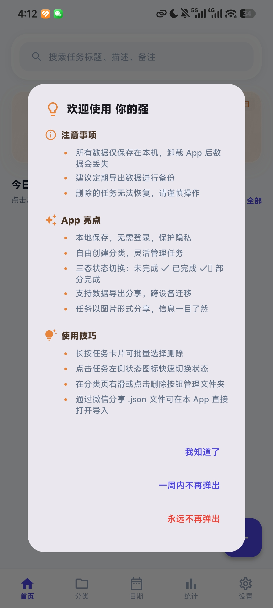
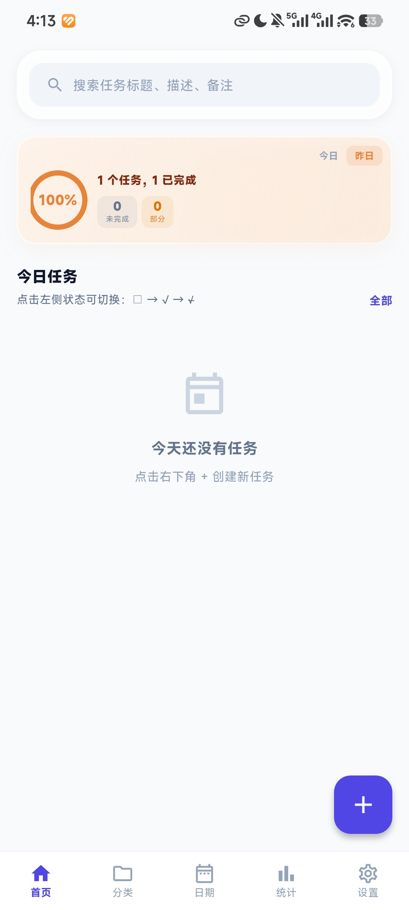
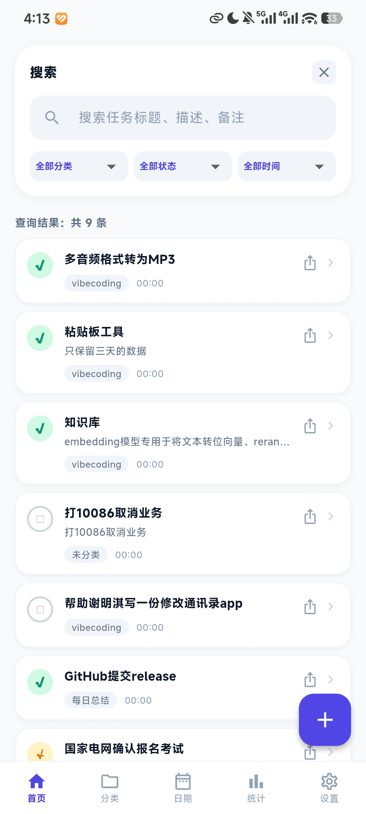
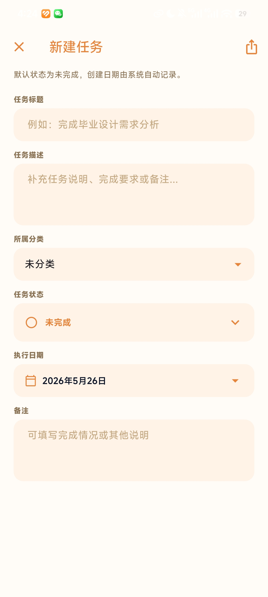
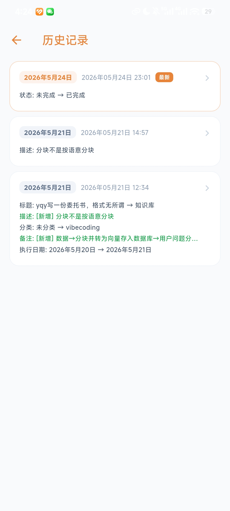
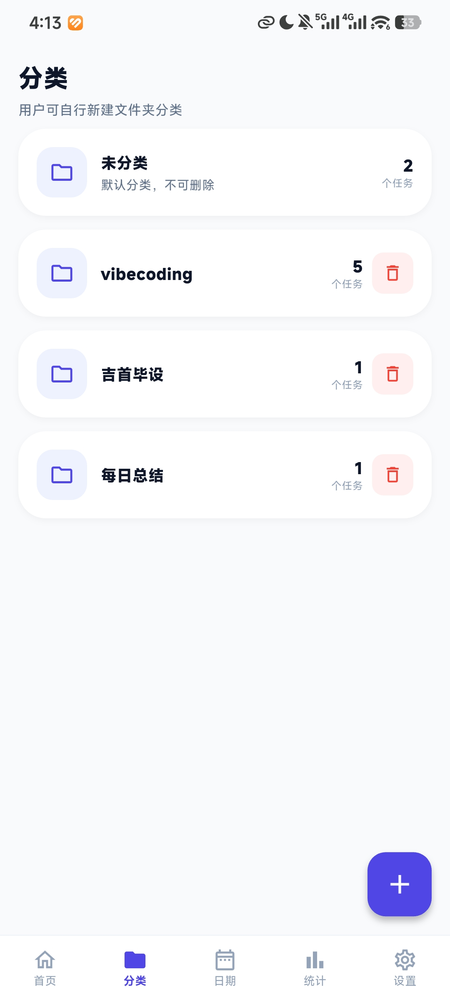
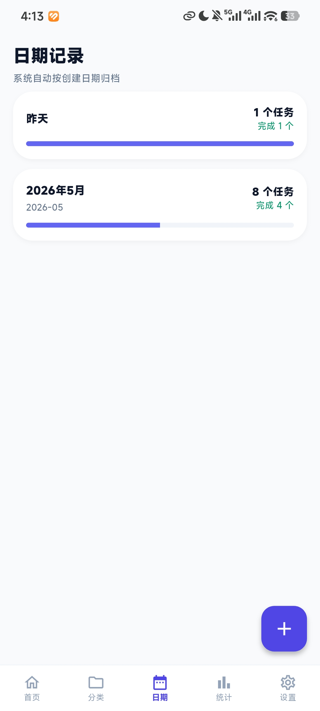
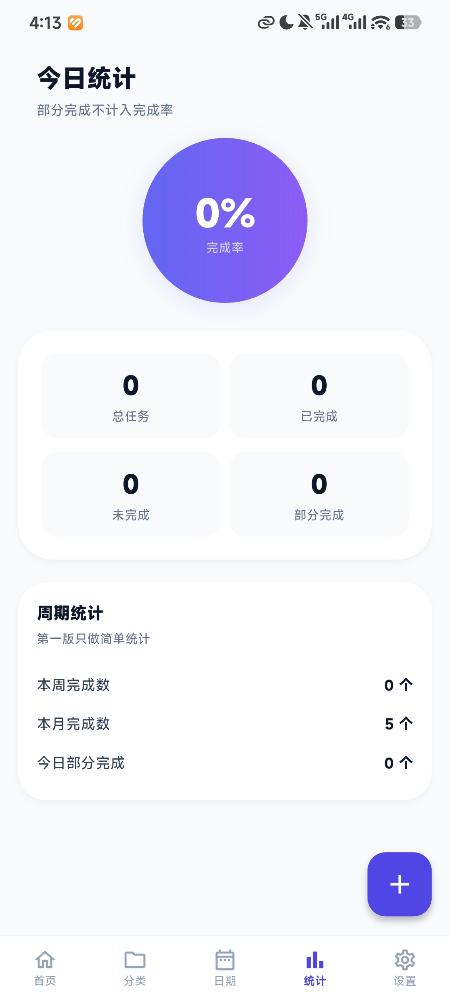
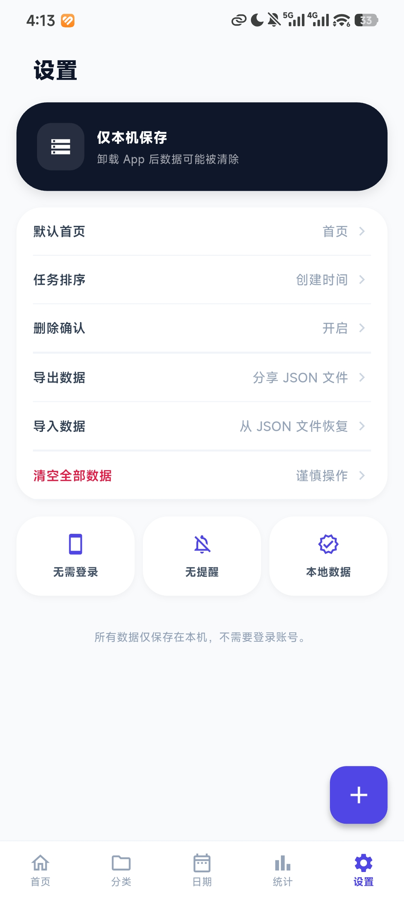

# Advanced Transcription

一个基于 Flutter 的本地任务管理应用。

## 功能特点

- **任务管理**：创建、编辑、删除任务，支持三种状态循环（待办 → 已完成 → 部分完成 → 待办）
- **分类管理**：通过文件夹对任务进行分组，默认"未分类"文件夹不可删除
- **日期视图**：按日期筛选和查看任务
- **统计页面**：任务完成情况统计
- **搜索功能**：快速搜索任务
- **修改历史**：记录每次编辑的字段变更，支持查看历史详情
- **数据导入/导出**：支持 JSON 格式的导入导出
- **微信导入**（Android）：通过 Intent 接收外部 .json 文件

## 技术栈

- **Flutter** (Dart SDK ^3.11.5)
- **Provider** 6.x — 状态管理
- **Hive** 2.x — 本地持久化（JSON 序列化）
- **uuid** — 任务/文件夹 ID 生成
- **intl** — 日期格式化
- **share_plus / file_picker / path_provider** — 数据导入导出

## 数据架构

所有数据仅保存在本机，无需登录。数据流：

```
用户操作 → Provider 方法 → 修改内存数据 → 写 Hive → 刷新 UI
```

状态集中在 `AppProvider`（ChangeNotifier），页面通过 `context.watch<>()` 监听变更。

## 开发命令

```bash
flutter pub get                 # 安装依赖
flutter run                     # 运行应用
flutter build apk --target-platform android-arm64  # 构建 APK
flutter analyze                 # 代码分析
```

## 项目结构

```
lib/
├── main.dart                   # 入口：初始化 Hive、挂载 Provider
├── app.dart                    # MaterialApp + 路由 + 导入处理
├── models/                     # 数据模型（Task / Folder / AppSettings 等）
├── providers/                  # 全局状态管理（AppProvider）
├── pages/                      # 页面
├── widgets/                    # UI 组件
└── utils/                      # 工具函数（常量、日期处理、Intent 处理）
```

## 结果展示

### 首页和搜索页面






### 添加编辑和历史记录页面



### 分类日期分类页面



### 统计和设置页面


